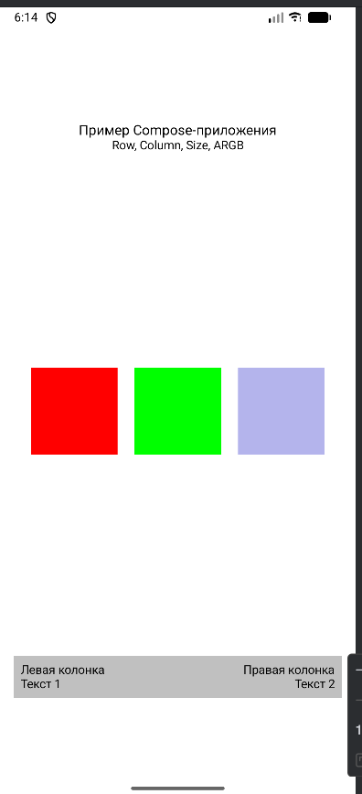

# Лабораторная работа №5. Jetpack Compose: контейнеры, ARGB-модель и Material Design

## Цель работы
Повторить основы разработки пользовательского интерфейса на Jetpack Compose, работу с контейнерами Row и Column, познакомиться с ARGB-моделью цветов, компонентом Scaffold и принципами Material Design.

## Описание приложения
Приложение демонстрирует основные возможности Jetpack Compose для создания пользовательского интерфейса:

- **Column** используется как основной вертикальный контейнер для размещения элементов
- **Row** применяется для горизонтального расположения цветных квадратов
- **Box** отображает цветные блоки заданного размера
- Реализован заголовок из двух строк текста
- Отображаются три цветных квадрата (красный, зелёный, синий)
- Один из квадратов выполнен полупрозрачным с использованием ARGB-модели
- Реализован комбинированный контейнер с вложенными Row и Column для отображения текста
- Все цвета заданы в ARGB-формате (Hex)
- Код разбит на отдельные @Composable функции для лучшей структуры и переиспользования

## Скриншот результата

## Минимальные требования
- Android API 25 и выше
- Android Studio

## Запуск проекта
1. Откройте проект в Android Studio
2. Дождитесь завершения синхронизации Gradle
3. Запустите приложение на эмуляторе или реальном устройстве (Shift+F10)
